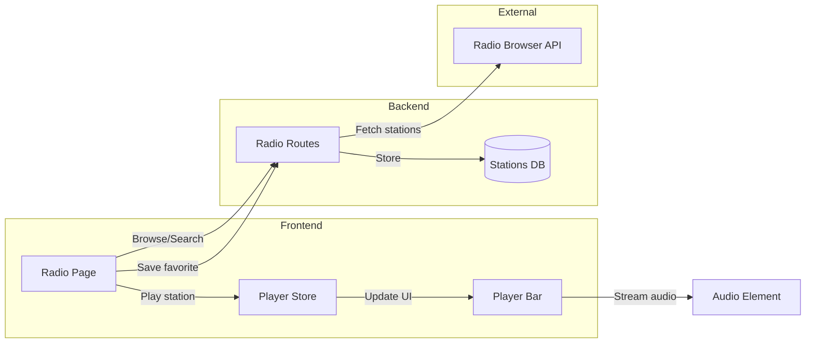

# Home Page Enhancement, Lyrics, Unified Radio & Highlight Fix

## Overview
This plan implements four improvements to enhance user experience:
1. More engaging Home page with additional content sections
2. Functional lyrics fetching via LRCLIB API
3. Unified radio playback through the main PlayerBar with Radio Browser API integration
4. Subtle 1-second highlight animation for track navigation

---

## Task 1: Enhanced Home Page

### Goal
Add engaging content sections to make the Home page more dynamic and useful.

### Backend Changes

**Update: `/backend/app/api/routes/tracks.py`**
- `GET /api/tracks/stats` - Get listening statistics
  - Total play count
  - Total listening time (sum of durations * play_count)
  - Most played artist
  - Most played genre
- `GET /api/tracks/continue-listening` - Get recently played tracks (last 10 unique)

### Frontend Changes

**Update: `/src/pages/Home.tsx`**

Add new sections after the carousel:

1. **Quick Play Cards** (horizontal row)
   - "Shuffle All" - plays all tracks shuffled
   - "Recently Played" - plays last 20 played tracks
   - "Favorites Mix" - plays liked tracks shuffled
   - Each card: gradient background, icon, click to play

2. **Continue Listening** (horizontal scroll)
   - Shows last 10 recently played tracks
   - Small track cards with artwork, title, artist
   - Click to resume from that track

3. **Top Artists** (horizontal scroll)
   - Top 6 artists by track count
   - Circular artwork cards
   - Click navigates to artist page

4. **Listening Stats Widget** (sidebar card)
   - Total tracks played
   - Total listening time (formatted as hours/minutes)
   - Most played artist
   - Most played genre
   - Styled as a glass-morphism card

**New API: `/src/api/stats.ts`**
```typescript
export const statsApi = {
  getStats: async () => fetch('/api/tracks/stats'),
  getContinueListening: async () => fetch('/api/tracks/continue-listening')
}
```

### Component Structure
```
Home.tsx
├── Hero Carousel (existing)
├── Quick Play Cards (new)
│   ├── Shuffle All
│   ├── Recently Played
│   └── Favorites Mix
├── Grid Layout
│   ├── Main Content (8 cols)
│   │   ├── Continue Listening (new)
│   │   ├── Top Artists (new)
│   │   └── Albums (existing)
│   └── Sidebar (4 cols)
│       ├── Listening Stats (new)
│       └── Recently Added (existing)
```

---

## Task 2: Lyrics Integration via LRCLIB API

### Goal
Make the lyrics button (Mic2 icon) functional by fetching lyrics from LRCLIB.

### Backend Changes

**New file: `/backend/app/api/routes/lyrics.py`**
```python
router = APIRouter(prefix="/lyrics", tags=["lyrics"])

@router.get("/{track_id}")
async def get_lyrics(track_id: int, db: Session = Depends(get_db)):
    # Get track from DB
    # Call LRCLIB API: https://lrclib.net/api/get?artist={artist}&track={title}
    # Return { synced: bool, lyrics: string, syncedLyrics: string|null }
```

**LRCLIB API Details:**
- Base URL: `https://lrclib.net/api/get`
- Parameters: `artist`, `track`, `album` (optional), `duration` (optional)
- Returns: `{ syncedLyrics: string|null, plainLyrics: string }`
- No API key required, free to use

**Update: `/backend/app/main.py`**
- Register lyrics router

### Frontend Changes

**New file: `/src/components/ui/LyricsPanel.tsx`**
```typescript
interface LyricsPanelProps {
  isOpen: boolean;
  onClose: () => void;
}

// Features:
// - Slide-out panel from right side
// - Fetches lyrics when track changes
// - Synced lyrics: highlights current line based on timestamp
// - Plain lyrics: simple scrollable text
// - Loading and error states
// - "No lyrics found" fallback
```

**Update: `/src/stores/uiStore.ts`**
- Add `lyricsOpen: boolean`
- Add `toggleLyrics: () => void`

**Update: `/src/components/layout/PlayerBar.tsx`**
- Connect Mic2 button to `toggleLyrics()`
- Highlight button when lyrics panel is open

**Update: `/src/App.tsx`**
- Add LyricsPanel component (renders alongside Queue panel)

**New API: `/src/api/lyrics.ts`**
```typescript
export const lyricsApi = {
  getLyrics: async (trackId: number) => 
    fetch(`/api/lyrics/${trackId}`)
}
```

### Synced Lyrics Logic
```typescript
// Parse LRC format: [mm:ss.xx]Lyric line
// Track currentTime from player
// Find current lyric line based on timestamp
// Auto-scroll to current line
// Highlight current line with pink color
```

---

## Task 3: Unified Radio Player + Radio Browser API

### Goal
1. Play radio streams through the main PlayerBar
2. Add thousands of stations via Radio Browser API

### Backend Changes

**Update: `/backend/app/api/routes/radio.py`**

Add new endpoints for Radio Browser API:
```python
RADIO_BROWSER_API = "https://de1.api.radio-browser.info/json"

@router.get("/browse/countries")
async def get_countries():
    # GET {API}/countries
    # Returns list of countries with station counts

@router.get("/browse/genres")
async def get_genres():
    # GET {API}/tags?limit=50&order=stationcount&reverse=true
    # Returns popular genres/tags

@router.get("/browse/search")
async def search_stations(
    name: str = None,
    country: str = None,
    tag: str = None,
    limit: int = 50
):
    # GET {API}/stations/search?name=...&country=...&tag=...
    # Returns matching stations

@router.get("/browse/top")
async def get_top_stations(limit: int = 50):
    # GET {API}/stations/topvote?limit=50
    # Returns top-voted stations

@router.post("/browse/{station_uuid}/click")
async def register_click(station_uuid: str):
    # POST {API}/url/{station_uuid}
    # Register station click (helps ranking)
```

### Frontend Changes

**Update: `/src/stores/playerStore.ts`**

Modify radio mode to use main audio element:
```typescript
interface PlayerState {
  // Existing...
  isRadioMode: boolean;
  currentRadioStation: RadioStation | null;
  
  // New methods
  playRadio: (station: RadioStation) => void;
  stopRadio: () => void;
}

// playRadio implementation:
// - Set isRadioMode = true
// - Set currentRadioStation = station
// - Load station.url into audio element
// - Play audio
// - Disable next/prev/seek (not applicable for radio)
```

**Update: `/src/components/layout/PlayerBar.tsx`**

Handle radio mode display:
```typescript
// When isRadioMode:
// - Show station name instead of track title
// - Show station genre instead of artist
// - Show radio icon instead of artwork (or station logo if available)
// - Disable progress bar (live stream)
// - Disable next/prev buttons
// - Show "Live" indicator
```

**Update: `/src/pages/Radio.tsx`**

Complete redesign:
```typescript
// Remove separate audio player at top
// Add tabbed interface:
// - "My Stations" (existing custom + favorites)
// - "Browse" (Radio Browser API)
// - "Search"

// Browse tab sections:
// - Top Stations (horizontal scroll)
// - By Country (dropdown + grid)
// - By Genre (tag pills + grid)

// Station card: click plays through main PlayerBar
// Favorite button saves to local stations
```

**New API: `/src/api/radio.ts`** (update existing)
```typescript
export const radioApi = {
  // Existing methods...
  
  // New browse methods
  getCountries: async () => fetch('/api/radio/browse/countries'),
  getGenres: async () => fetch('/api/radio/browse/genres'),
  searchStations: async (params) => fetch('/api/radio/browse/search?...'),
  getTopStations: async (limit = 50) => fetch('/api/radio/browse/top'),
  registerClick: async (uuid) => fetch('/api/radio/browse/{uuid}/click', POST)
}
```

### Architecture Flow


---

## Task 4: Subtle Track Highlight Animation

### Goal
Replace permanent highlight with a brief 1-second fade animation.

### Frontend Changes

**Update: `/src/components/ui/TrackList.tsx`**

Replace static highlight with animated version:

```typescript
// Current behavior (remove):
isHighlighted && "bg-pink-500/20 ring-1 ring-pink-500/50"

// New behavior:
const [flashingTrackId, setFlashingTrackId] = useState<number | null>(null);

useEffect(() => {
  if (highlightTrackId) {
    setFlashingTrackId(highlightTrackId);
    
    // Clear highlight after 1 second
    const timer = setTimeout(() => {
      setFlashingTrackId(null);
    }, 1000);
    
    return () => clearTimeout(timer);
  }
}, [highlightTrackId]);
```

**Update: `/src/components/ui/TrackList.tsx` - TrackRow component**

Add CSS transition for smooth fade:
```typescript
<div
  className={cn(
    "...",
    flashingTrackId === track.id && "animate-highlight-flash"
  )}
>
```

**Update: `/src/index.css`**

Add keyframe animation:
```css
@keyframes highlight-flash {
  0% {
    background-color: rgba(236, 72, 153, 0);
  }
  20% {
    background-color: rgba(236, 72, 153, 0.3);
    box-shadow: inset 0 0 0 1px rgba(236, 72, 153, 0.5);
  }
  100% {
    background-color: rgba(236, 72, 153, 0);
    box-shadow: none;
  }
}

.animate-highlight-flash {
  animation: highlight-flash 1s ease-out forwards;
}
```

### Behavior
1. User clicks track info in PlayerBar
2. Navigate to album page with `?highlight={trackId}`
3. TrackList scrolls to track
4. Track row briefly glows pink (peaks at 200ms)
5. Glow fades out over remaining 800ms
6. Track appears normal after animation completes

---

## File Structure Summary

### New Backend Files
```
/backend/app/api/routes/
  └── lyrics.py          # LRCLIB integration
```

### Updated Backend Files
```
/backend/app/api/routes/
  ├── tracks.py          # Add stats, continue-listening endpoints
  ├── radio.py           # Add Radio Browser API endpoints
  └── main.py            # Register lyrics router
```

### New Frontend Files
```
/src/
  ├── api/
  │   ├── lyrics.ts      # Lyrics API calls
  │   └── stats.ts       # Stats API calls
  └── components/ui/
      └── LyricsPanel.tsx # Lyrics display panel
```

### Updated Frontend Files
```
/src/
  ├── pages/
  │   ├── Home.tsx       # New sections
  │   └── Radio.tsx      # Redesigned with browse
  ├── stores/
  │   ├── playerStore.ts # Radio integration
  │   └── uiStore.ts     # Lyrics panel state
  ├── components/
  │   ├── layout/
  │   │   └── PlayerBar.tsx  # Radio mode, lyrics button
  │   └── ui/
  │       └── TrackList.tsx  # Flash animation
  ├── api/
  │   └── radio.ts       # Browse methods
  ├── App.tsx            # LyricsPanel
  └── index.css          # Animation keyframes
```

---

## Implementation Order

1. **Task 4: Highlight Fix** - Quick CSS/state change
2. **Task 2: Lyrics** - Self-contained feature
3. **Task 1: Home Page** - UI enhancements
4. **Task 3: Unified Radio** - Most complex, refactors existing code

---

## External APIs Used

| API | Purpose | Auth | Rate Limit |
|-----|---------|------|------------|
| LRCLIB | Lyrics fetching | None | Reasonable use |
| Radio Browser | Station discovery | None | None stated |

